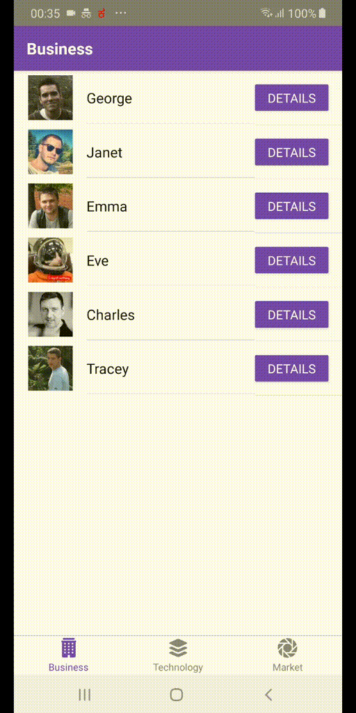

# React Native Stater Kit with Redux and React navigation

This starter kit help to start with react native project which will take from scratch to MVP

# Features

    React Navigation (V4)
    Container Pattern
    create-react-native-app
    Dynamic routing
    Listing page
    Details page
    Easily extendable to add new page with in very short time
    Redux with API integration
    Used Native base components
    Tested on Android mobile
    Battle tested listing page up to 4000 records

# Documentation Followed

    https://facebook.github.io/react-native/docs/running-on-device

    https://reactnavigation.org/

    https://docs.nativebase.io/

# Demo

# Data source for testing

    The sample api was taken from https://reqres.in

# How to Run

Yarn start

For android react-native run-android (This will install apk in connected android device which will be used for dev and debug purpose)